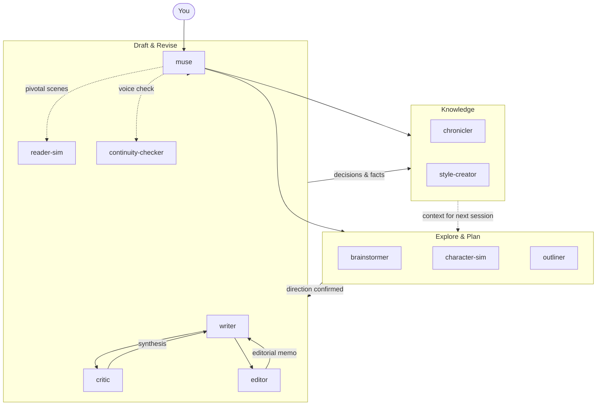

# Creative Writing Skills

[](https://github.com/haowjy/creative-writing-skills/actions/workflows/ci.yml)
[](LICENSE)

Write novels, short stories, and serial fiction with AI that maintains your voice, tracks your continuity, and gets better the more you use it. From first brainstorm to polished draft: specialized agents handle each mode of work (writing, critiquing, revising, exploring) while shared skills carry the craft methodology.

**What you get:**
- **Brainstorm without committing**: explore plot options, character arcs, and world mechanics with multiple AI perspectives before deciding anything
- **Write in your voice**: create style files from your existing prose, then draft new scenes that match
- **Catch your own mistakes**: structured critique, continuity checks, and simulated reader reactions
- **Keep everything in sync**: knowledge base updates as your story evolves

## Quick Start

```bash
meridian mars add haowjy/creative-writing-skills
meridian mars sync
meridian bootstrap
```

## Installation

### Mars (Meridian)

```bash
meridian mars add haowjy/creative-writing-skills
meridian mars sync
```

Then run `meridian` to start a session with muse. First-time setup runs the bootstrap automatically.

### Claude Code / Cowork

Claude Code and Cowork use the same plugin format.

**Claude Code**: add the marketplace and install:

```bash
/plugin marketplace add haowjy/creative-writing-skills
/plugin install creative-writing-skills@cw
```

**Cowork**: in the sidebar, **Customize** → **Personal plugins** → **+** → **Create plugins** → **Add marketplace** → **Add from repository**, enter `haowjy/creative-writing-skills`, then install the **creative-writing-skills** plugin. (Same flow as [Claude.ai](#claudeai) below — Cowork just also runs the agents.)

Once installed, start a session with muse as your agent:

```bash
claude --agent creative-writing-skills:muse
```

Run the one-time project setup to create your `CLAUDE.md` and `kb/` structure:

```
/creative-writing-skills:project-setup
```

### Claude.ai

`creative-writing-muse` turns an ordinary Claude chat into a creative writing partner. Turn it on, tell it what you're working on, and it carries you from first idea to finished draft in one conversation — talking through ideas, drafting scenes in your voice, flagging what isn't working, and revising. The other skills (prose, scene craft, critique, structure) are the craft knowledge it draws on; you don't have to invoke them yourself.

First, add the skills to claude.ai — pick one:

- **Add the marketplace (easiest):** in the sidebar, **Customize** → **Personal plugins** → **+** → **Create plugins** → **Add marketplace** → **Add from repository**, enter `haowjy/creative-writing-skills`, and click **Sync**.

  
- **Upload the files:** download the `.skill` files from the [latest release](https://github.com/haowjy/creative-writing-skills/releases/latest), then **Customize** → **Skills** → **"+"** → **Upload skill** for each one.

Then start a chat, turn on **`creative-writing-muse`**, and describe what you want to write — it leads from there. Adding skills one at a time instead? Start with **creative-writing-muse**, **writing-principles**, **creative-writing-craft**, **creative-writing-craft**, and **story-review**.

> Want to build the files yourself? Clone the repo and run `python scripts/create_skill_zips.py` to regenerate them in `zips/`.

## How It Works



**Explore:** Fan out brainstormers for creative variety. Spawn character-sims to discover voices. Use outliners to shape structure once a direction is chosen.

**Draft & Revise:** Muse routes prose work to writer: fresh drafts, revisions, bridges, alternate takes, and polish. Critics evaluate focused craft dimensions; editor gives holistic book-editor priority across structure, voice, line quality, copy consistency, and proofing. Reader-sim gives experiential signal on pivotal scenes.

**Knowledge:** Chronicler extracts facts from completed chapters into the kb. Style-creator captures voice patterns from prose samples. The kb grows as the project evolves, giving every future agent accurate context.

## Agents

| Agent | Role |
|---|---|
| **muse** | Author-facing creative partner for all story work, from planning through production handoff |
| **writer** | Production prose from briefs, critique notes, and style references; uses progressive mode guidance for drafts, revisions, bridges, alternate takes, and line polish |
| **critic** | Deep adversarial critique of a draft, one focus area at a time |
| **editor** | Holistic third-party book editor pass: structure, voice, line quality, copy consistency, and proofing priority |
| **reader-sim** | Experiential reader response to a draft, moment by moment |
| **character-sim** | In-character conversation for voice discovery and relationship testing |
| **continuity-checker** | Cross-references content against established canon for contradictions |
| **brainstormer** | Creative option generation for a scoped question or angle |
| **outliner** | Sequences confirmed direction into arc, chapter, and beat-level outlines |
| **style-creator** | Analyzes prose samples to produce style reference files for the project's voice |
| **chronicler** | Extracts factual state changes from written chapters into the kb |

## Skills

| Skill | Purpose |
|---|---|
| **creative-writing-modes** | Pen-on-paper prose modes: fresh draft, revision, bridge, alternate take, and line polish |
| **creative-writing-craft** | Craft references for prose, scenes, style, voice, and genre/page-level technique |
| **writing-principles** | Reader reward channels, AI failure modes, and fiction-specific taste discipline |
| **story-planning** | Direction, brainstorming, outlining, and story architecture before pages exist |
| **story-review** | Editorial review, developmental edit, line edit, copyedit, proofreading, craft critique, and reader-signal synthesis |
| **story-memory** | Context, fact extraction, reference writing, artifact layout, and persistent issue tracking |
| **reader-sim** | Skill-only first-time reader simulation from a specified persona |
| **character-sim** | Skill-only in-character conversation for voice and relationship testing |
| **creative-writing-muse** | Single-agent muse mode for environments without spawned agents |
| **writing-staffing** | Agent composition for writing workflows |
| **llm-writing** | Intentional language discipline: catches unchosen LLM defaults while preserving deliberate ambiguity, omission, repetition, and rhythm |
| **shared-dao** | Shared vocabulary: canonical story terms, aliases, and ambiguity resolution |
| **project-setup** | One-time guided setup: creates CLAUDE.md and kb structure |

## Project Layout

```text
my-story/
├── CLAUDE.md              # Project conventions (created by project-setup)
├── story/                 # Chapters and manuscript
├── work/                  # Current drafting effort
│   ├── outline/
│   ├── drafts/
│   ├── critique-reports/
│   └── brainstorm/
└── kb/                    # Durable knowledge base
    ├── styles/            # Voice reference files
    ├── characters/        # Character state and profiles
    ├── world/             # Locations, lore, systems
    ├── timeline/          # Chronology
    ├── canon/             # Established facts
    └── issues/            # Tracked writing problems
```

## Compatibility

| Feature | Claude Code | Cowork | Mars (Meridian) | Claude.ai |
|---|:---:|:---:|:---:|:---:|
| All agents | Yes (flat) | Yes (flat) | Yes | No (grayed out in chat) |
| All skills | Yes | Yes | Yes | Marketplace add or zip |
| Multi-agent orchestration | Via muse | Via muse | Via muse → focused workers | No |
| Project setup | Yes | Yes | Yes | No |

Claude Code, Cowork, and Meridian use muse as the main coordinator over a compact worker set: writer, critic, reader-sim, brainstormer, outliner, character-sim, style-creator, chronicler, and continuity-checker. You can add the marketplace to the Claude desktop app from GitHub; Cowork runs the agents, but plain claude.ai chat runs skills only (agents grayed out) — there the `creative-writing-muse` skill provides single-agent muse mode in one conversation, backed by the craft skills.

## Current Experiments

**Rhetorical questions in skill prompts.** The economy section in `writing-principles` uses rhetorical questions ("what can you leave out and still have the scene work?") rather than declarative statements. LLMs can distinguish rhetorical from information-seeking questions internally ([arxiv 2604.14128](https://arxiv.org/abs/2604.14128)), and Self-Ask prompting shows questions improve reasoning, but no research directly tests whether rhetorical questions in system prompts improve task performance vs. equivalent declaratives. Keeping the rhetorical form to see if it activates a self-check loop that declaratives don't.

## Development

### Validate package

```bash
meridian mars check
```

### Release

```bash
mars version patch              # bump, commit, tag
mars version patch --push       # bump, commit, tag, push
```

## License

Apache License 2.0. See [LICENSE](LICENSE).
