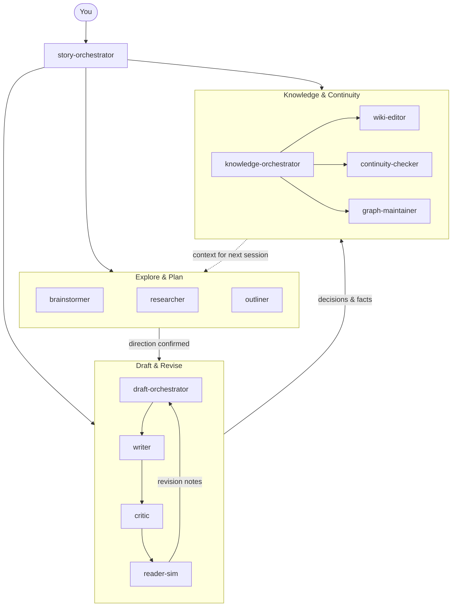
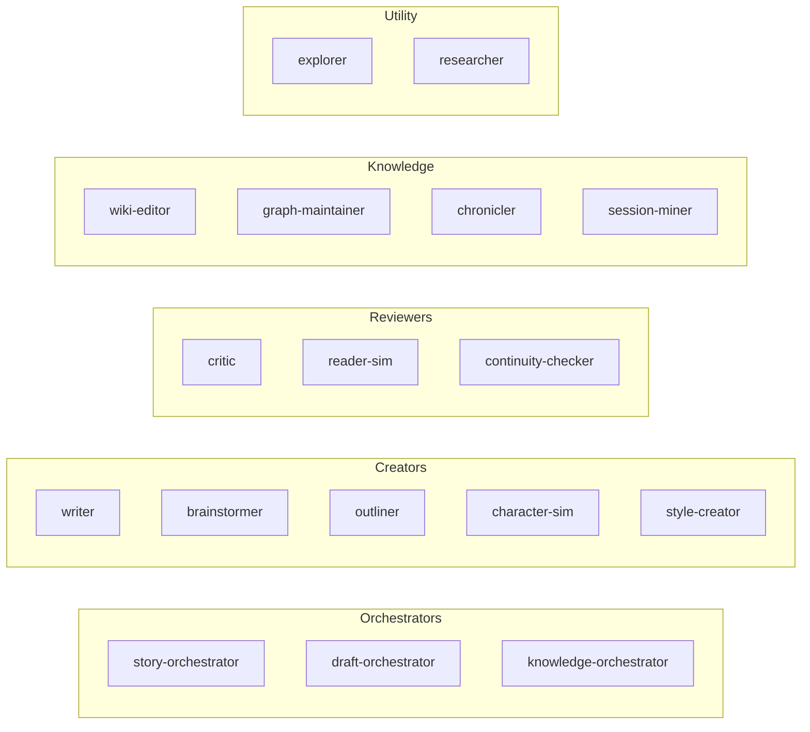
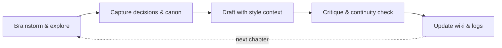

# Creative Writing Skills

[](https://github.com/haowjy/creative-writing-skills/actions/workflows/ci.yml)
[](LICENSE)

Write novels, short stories, and serial fiction with AI that maintains your voice, tracks your continuity, and gets better the more you use it. This package gives [Claude Code](https://docs.anthropic.com/en/docs/claude-code) a full creative writing workflow — from first brainstorm to polished draft — through 17 specialized agents and 12 composable skills.

**What you get:**
- **Brainstorm without committing** — explore plot options, character arcs, and world mechanics with multiple AI perspectives before deciding anything
- **Write in your voice** — create a style guide from your existing prose, then draft new scenes that match it
- **Catch your own mistakes** — automated continuity checks, structured critique, and simulated reader reactions
- **Keep everything in sync** — wiki pages, decision logs, and knowledge graphs update as your story evolves

## Quick Start

```bash
# Install
meridian mars add haowjy/creative-writing-skills
meridian mars sync

# Start writing
claude
> "Help me brainstorm a magic system for my fantasy world"
```

The `story-orchestrator` agent handles routing — just describe what you want to do.

## How It Works



**Explore:** Fan out brainstormers across diverse models for creative breadth. Researchers pull real-world references. Outliners shape structure.

**Draft & Revise:** The draft-orchestrator runs autonomous write/critique loops — writer produces prose, critics evaluate across multiple dimensions, reader-sims report their experience, and the cycle repeats until converged.

**Knowledge & Continuity:** Every accepted change triggers knowledge maintenance — wiki updates, continuity checks, and graph rebuilds so the next session starts with accurate context.

## Compatibility

| Feature | Mars (Claude Code) | Plugin (Claude Code) | Claude.ai |
|---|:---:|:---:|:---:|
| All 17 agents | Yes | Yes | No |
| All 12 skills | Yes | Yes | Yes (upload `.skill` files) |
| Slash commands | Yes | Yes | No |
| Multi-agent orchestration | Yes | Yes | No |
| Auto-updates via `mars sync` | Yes | No | No |
| Dependency management | Yes | No | No |

## Installation

### Mars (recommended)

[Mars](https://github.com/haowjy/meridian-channel) is a package manager for Claude Code agents and skills.

```bash
meridian mars add haowjy/creative-writing-skills
meridian mars sync
```

If you have the standalone `mars` CLI, `mars add` / `mars sync` also works.

### Claude Code plugin (legacy)

```bash
claude plugin marketplace add haowjy/creative-writing-skills
claude plugin install creative-writing-skills@creative-writing-skills
```

### Claude.ai

Download `.skill` files from [GitHub Releases](https://github.com/haowjy/creative-writing-skills/releases) and upload in **Settings > Capabilities > Skills**.

Start with: `cw-router.skill`, `prose-writing.skill`, `brainstorming.skill`, `prose-critique.skill`. Use `cw-router` to navigate between skills. The full agent system is Claude Code only.

## Agents



| Agent | Role |
|---|---|
| **story-orchestrator** | Primary entry point — coordinates all creative writing workflows |
| **draft-orchestrator** | Runs the draft/critique loop with writers, critics, reader-sims |
| **knowledge-orchestrator** | Coordinates wiki updates, graph maintenance, continuity checks |
| **writer** | Writes prose in the project's established style |
| **critic** | Structured critique across four reader reward channels |
| **reader-sim** | Simulates a reader's experience, reports per-channel engagement |
| **character-sim** | Simulates character behavior for dialogue testing and scene exploration |
| **brainstormer** | Wide-open option generation on a scoped question |
| **outliner** | Structural decomposition into beat sheets and arc maps |
| **explorer** | Fast project exploration — finds files, searches content |
| **researcher** | Web research for worldbuilding and fact-checking |
| **continuity-checker** | Checks drafts against established canon |
| **wiki-editor** | Creates and maintains wiki documentation |
| **graph-maintainer** | Updates the project knowledge graph |
| **chronicler** | Records session decisions into persistent notes |
| **session-miner** | Mines past session transcripts for unreported decisions |
| **style-creator** | Analyzes existing prose to create style guides |

## Skills

| Skill | Purpose |
|---|---|
| **brainstorming** | Exploratory idea generation with [TBD] markers |
| **prose-writing** | Voice matching, scene construction, prose craft |
| **prose-critique** | Multi-dimensional feedback (character, voice, structure, prose, continuity) |
| **prose-analysis** | Quantitative prose pattern analysis |
| **wiki-docs** | Encyclopedic documentation with citations |
| **story-architecture** | Arc shape, tension curves, structural analysis |
| **story-context** | Loading relevant story context before tasks |
| **story-decisions** | Decision logging and retrieval |
| **knowledge-graph** | Project knowledge graph maintenance |
| **writing-principles** | Four reward channels, AI failure modes, craft tradition |
| **writing-artifacts** | Artifact types and file conventions |
| **writing-staffing** | Agent roster and coordination patterns |

## Usage

### Slash Commands (Claude Code)

| Command | What it does |
|---|---|
| `/bs` | Brainstorm and explore story ideas |
| `/write [style]` | Enter prose-writing mode (optionally with a style) |
| `/wiki` | Create canonical wiki/documentation pages |
| `/critique` | Critique prose with structured feedback |

### Examples

```
"Help me brainstorm ideas for my magic system"
"Write the next scene where my protagonist discovers the truth"
"Critique this chapter for pacing and character consistency"
"Create a wiki page for this location"
"Analyze my writing style and create a style guide from these chapters"
```

## Project Setup

```text
my-story/
├── mars.toml              # Dependencies
├── .claude/
│   └── CLAUDE.md          # Project instructions
├── .agents/               # Managed by mars sync
├── story/                 # Chapters and drafts
├── wiki/                  # Character profiles, lore, locations
├── style/
│   └── style-guide.md     # Your voice reference
└── notes/                 # Planning, brainstorms, decision logs
```



## Development

### Build Claude.ai skill zips

```bash
python3 scripts/create_skill_zips.py   # outputs to zips/*.skill
```

### Validate package

```bash
meridian mars check
```

### Release

```bash
./scripts/release.sh              # patch bump, commit, tag
./scripts/release.sh minor        # minor bump
./scripts/release.sh major        # major bump
./scripts/release.sh --push       # patch + push (triggers CI release)
```

### CI/CD

- **Push / PR to `main`:** `mars check`, frontmatter validation, lock freshness, zip build.
- **Tag push (`v*`):** validates, builds `.skill` zips, creates GitHub Release with artifacts.

## License

Apache License 2.0. See [LICENSE](LICENSE).
