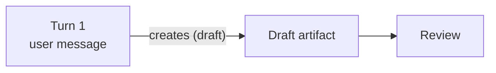

# Mermaid Diagram Rules

Use this skill when writing or editing fenced `mermaid` blocks. Keep diagrams readable in source and validate syntax before handing work back.

## Syntax Rules

- Quote node labels that contain punctuation, brackets, angle brackets, commas, emoji, or HTML: `A["Config (optional)"]`.
- Quote edge labels that contain punctuation or spaces around special terms: `A -->|"uses (runtime)"| B`.
- Use `<br/>` for line breaks in labels, not `\n`.
- Avoid lowercase `end` as a node label. Use `End` or quote the label.
- Prefer built-in themes over hardcoded fills. Hardcoded colors often break dark mode.
- If a node id starts with `o` or `x` after an edge, add a space so Mermaid does not parse it as a circle or cross edge: `A--- oNode`.



## Validation

Validate changed Markdown or `.mmd` files with the bundled helper:

```bash
uv run scripts/check_mermaid.py path/to/file.md
```

If `uv` is not available but Python is, run `python3 scripts/check_mermaid.py path/to/file.md`.

If only Node/npm is available, extract the Mermaid block to a temporary `.mmd` file and validate it directly with `npx`:

```bash
npx --yes @mermaid-js/mermaid-cli -q -i diagram.mmd -o diagram.svg
```

Use direct `npx` for standalone `.mmd` files or copied blocks. The Python helper is still preferred for Markdown files because it extracts fenced `mermaid` blocks and reports source line numbers.

The helper uses Mermaid CLI and returns a real pass/fail exit code. If Node.js/npm is not available, it prints a first-run notice and installs a private Node runtime under the user's cache directory. It prefers `uv` to create a venv for `nodeenv`, then falls back to `python -m venv` plus pip. This does not modify the repo or system Node installation. Set `MERMAID_VALIDATOR_NO_BOOTSTRAP=1` to disable automatic setup.

If the script cannot run because the machine has no usable Python, uv, mise, or Node/npm, do not improvise a system install silently. Tell the user Mermaid validation needs one of those tools and ask whether they want you to install one. Prefer uv or mise when available in the user's environment; otherwise direct installers for Python or Node are acceptable.
