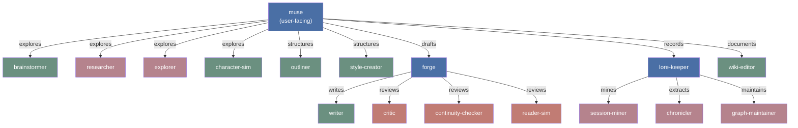
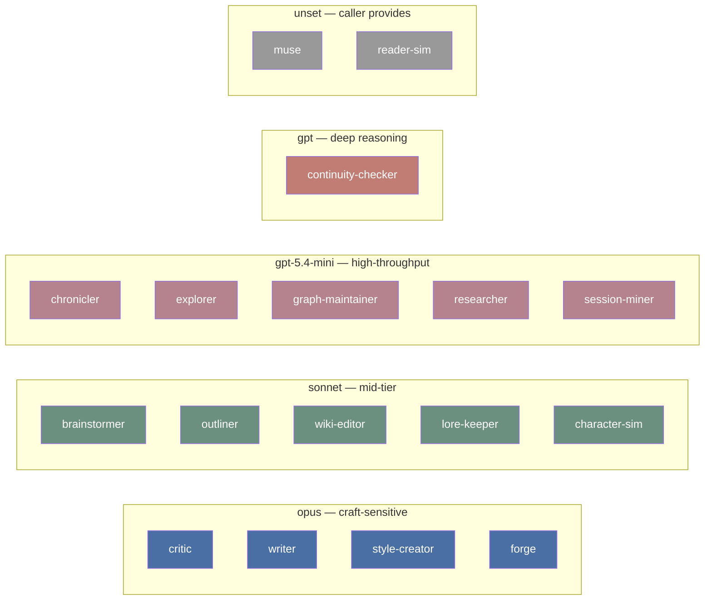
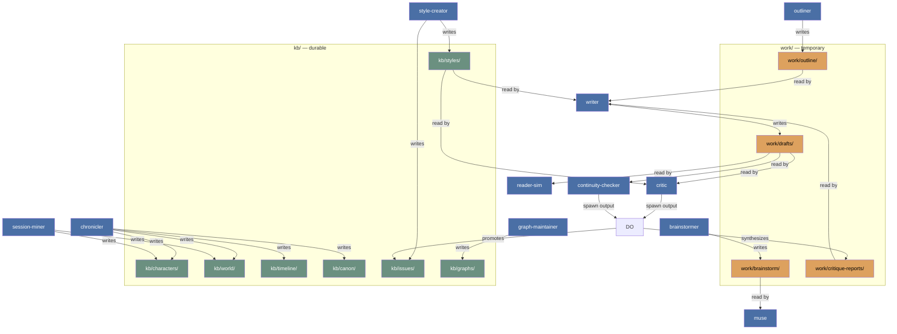

# Package Architecture

## Spawn Hierarchy

Who orchestrates whom. Arrows show spawn relationships.

## Skill Dependencies

Which agents load which skills. Meridian infrastructure skills (meridian-spawn, meridian-work-coordination) omitted — all three orchestrators load both. `md-validation` is from meridian-base (provides `meridian kg` and `meridian mermaid` CLI commands).

```mermaid
graph LR
    subgraph Orchestrators
        SO[muse]
        DO[forge]
        KO[lore-keeper]
    end

    subgraph Creative
        BS[brainstormer]
        OL[outliner]
        WR[writer]
        SC[style-creator]
        WE[wiki-editor]
    end

    subgraph Reviewers
        CR[critic]
        CC[continuity-checker]
        RS[reader-sim]
        CS[character-sim]
    end

    subgraph Knowledge
        SM[session-miner]
        CH[chronicler]
        GM[graph-maintainer]
        EX[explorer]
    end

    subgraph "Shared Skills"
        OR[orchestrate]
        WA[writing-artifacts]
        MV[md-validation]
        WP[writing-principles]
        SCtx[story-context]
        SD[story-decisions]
        WS[writing-staffing]
        WI[writing-issues]
        PC[prose-critique]
        IM[intent-modeling]
        LW[llm-writing]
    end

    subgraph "Single-Consumer Skills"
        BRS[brainstorming]
        SA[story-architecture]
        WD[wiki-docs]
        PW[prose-writing]
    end

    %% orchestrate — 3 orchestrators
    SO --> OR
    DO --> OR
    KO --> OR

    %% writing-artifacts — 6 agents
    SO --> WA
    DO --> WA
    KO --> WA
    CH --> WA
    GM --> WA
    SM --> WA

    %% md-validation — 7 agents (from meridian-base)
    KO --> MV
    CH --> MV
    CC --> MV
    EX --> MV
    GM --> MV
    OL --> MV
    WE --> MV

    %% writing-principles — 5 agents
    WR --> WP
    CR --> WP
    CS --> WP
    RS --> WP
    SC --> WP

    %% story-context — 5 agents
    SO --> SCtx
    DO --> SCtx
    KO --> SCtx
    BS --> SCtx
    WR --> SCtx

    %% story-decisions — 4 agents
    SO --> SD
    DO --> SD
    KO --> SD
    SM --> SD

    %% writing-staffing — 3 orchestrators
    SO --> WS
    DO --> WS
    KO --> WS

    %% writing-issues — 3 agents
    CR --> WI
    CC --> WI
    SC --> WI

    %% prose-critique — 2 agents
    CR --> PC
    CC --> PC

    %% intent-modeling — 2 agents (from meridian-base)
    SO --> IM
    BS --> IM

    %% llm-writing — 5 agents (from meridian-base)
    WR --> LW
    SC --> LW
    WE --> LW
    SM --> LW
    CH --> LW

    %% single-consumer skills
    BS --> BRS
    OL --> SA
    WE --> WD
    WR --> PW

    classDef orch fill:#4a6fa5,color:#fff
    classDef creative fill:#6b9080,color:#fff
    classDef review fill:#c17c74,color:#fff
    classDef knowledge fill:#b5838d,color:#fff
    classDef sharedSkill fill:#dda15e,color:#000
    classDef soloSkill fill:#e9c46a,color:#000

    class SO,DO,KO orch
    class BS,OL,WR,SC,WE,CS creative
    class CR,CC,RS review
    class SM,CH,GM,EX knowledge
    class OR,WA,MV,WP,SCtx,SD,WS,WI,PC,IM,LW sharedSkill
    class BRS,SA,WD,PW soloSkill
```

## Model Routing

Cost tiers mapped to agent roles.

## Artifact Flow

How work products move between agents. Arrows show write → read relationships.

## Skill Reuse Summary

| Skill | Consumers | Notes |
|---|---|---|
| md-validation | 7 | Link topology and mermaid validation (from meridian-base) — knowledge workers + reviewers + outliner + wiki-editor |
| writing-artifacts | 6 | Shared artifact contract — all orchestrators + knowledge workers |
| writing-principles | 5 | Reader psychology + AI failure modes — all prose-touching agents |
| llm-writing | 5 | General LLM writing discipline (from meridian-base) — writer, style-creator, wiki-editor, session-miner, chronicler |
| story-context | 5 | Context scoping — orchestrators + writer + brainstormer |
| story-decisions | 4 | Decision capture — orchestrators + session-miner |
| orchestrate | 3 | Coordination model — delegation, convergence, synthesis — orchestrators only |
| meridian-spawn | 3 | Spawn mechanics — orchestrators only |
| meridian-work-coordination | 3 | Work lifecycle — orchestrators only |
| writing-staffing | 3 | Team composition — orchestrators only |
| writing-issues | 3 | Issue tracking — critics + style-creator |
| intent-modeling | 2 | Intent reading discipline (from meridian-base) — muse + brainstormer |
| prose-critique | 2 | Critique methodology — critic + continuity-checker |
| brainstorming | 1 | Capture conventions — brainstormer only |
| story-architecture | 1 | Structure methodology — outliner only |
| wiki-docs | 1 | Wiki conventions — wiki-editor only |
| prose-writing | 1 | Drafting technique — writer only |
