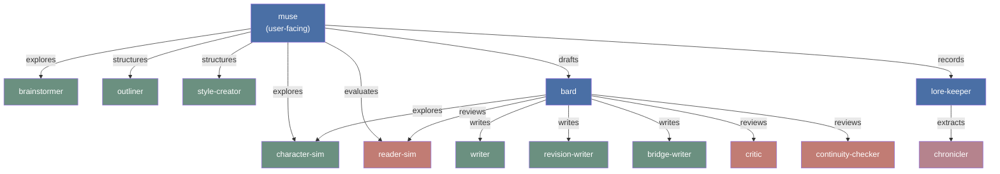
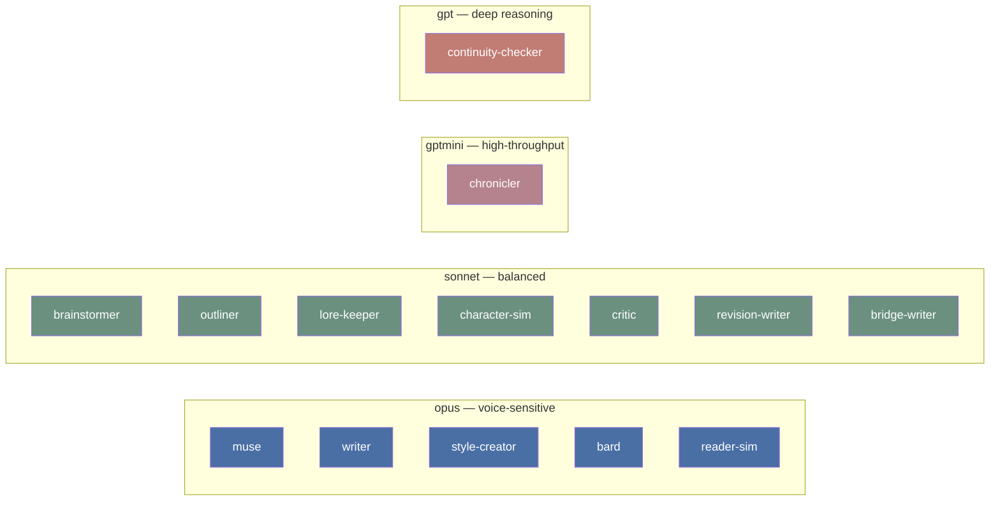
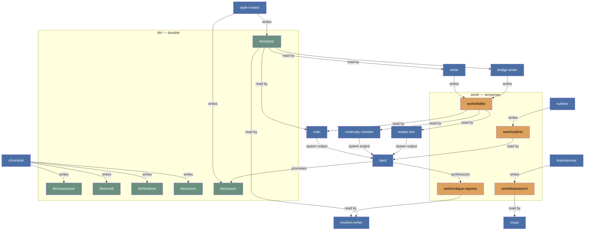

# Package Architecture

## Spawn Hierarchy

Who orchestrates whom. Arrows show spawn relationships.

## Skill Dependencies

Which agents load which skills. Meridian infrastructure skills (meridian-spawn, meridian-work-coordination, agent-management, decision-log) omitted — orchestrators load these. `md-validation`, `kb-conventions`, `intent-modeling`, and `llm-writing` are from meridian-base.

```mermaid
graph LR
    subgraph Orchestrators
        SO[muse]
        DO[bard]
        KO[lore-keeper]
    end

    subgraph Creative
        BS[brainstormer]
        OL[outliner]
        WR[writer]
        RW[revision-writer]
        BW[bridge-writer]
        SC[style-creator]
    end

    subgraph Reviewers
        CR[critic]
        CC[continuity-checker]
        RS[reader-sim]
        CS[character-sim]
    end

    subgraph Knowledge
        CH[chronicler]
    end

    subgraph "Shared Skills"
        WA[writing-artifacts]
        MV[md-validation]
        WP[writing-principles]
        SCtx[story-context]
        WS[writing-staffing]
        WI[writing-issues]
        PC[prose-critique]
        IM[intent-modeling]
        LW[llm-writing]
        PW[prose-writing]
        SCN[scene-construction]
        KC[kb-conventions]
    end

    subgraph "Single-Consumer Skills"
        BRS[brainstorming]
        SA[story-architecture]
        WD[wiki-docs]
        STYA[style-analysis]
    end

    %% writing-artifacts — 8 agents
    SO --> WA
    DO --> WA
    KO --> WA
    BS --> WA
    WR --> WA
    RW --> WA
    BW --> WA
    SC --> WA

    %% writing-principles — 7 agents
    SO --> WP
    WR --> WP
    RW --> WP
    BW --> WP
    CR --> WP
    CS --> WP
    RS --> WP
    SC --> WP

    %% llm-writing — 7 agents (from meridian-base)
    SO --> LW
    WR --> LW
    RW --> LW
    BW --> LW
    BS --> LW
    RS --> LW
    SC --> LW

    %% story-context — 8 agents
    SO --> SCtx
    DO --> SCtx
    KO --> SCtx
    BS --> SCtx
    WR --> SCtx
    RW --> SCtx
    BW --> SCtx
    CS --> SCtx

    %% prose-writing — 3 agents
    WR --> PW
    RW --> PW
    BW --> PW

    %% scene-construction — 3 agents
    WR --> SCN
    RW --> SCN
    BW --> SCN

    %% md-validation — 3 agents (from meridian-base)
    KO --> MV
    CH --> MV
    OL --> MV
    CC --> MV

    %% kb-conventions — 2 agents (from meridian-base)
    KO --> KC
    CH --> KC

    %% writing-staffing — 3 orchestrators
    SO --> WS
    DO --> WS
    KO --> WS

    %% writing-issues — 3 agents
    CR --> WI
    CC --> WI
    SC --> WI

    %% prose-critique — 2 agents
    CR --> PC
    CC --> PC

    %% intent-modeling — 2 agents (from meridian-base)
    SO --> IM
    BS --> IM

    %% single-consumer skills
    BS --> BRS
    SO --> BRS
    OL --> SA
    SC --> STYA

    classDef orch fill:#4a6fa5,color:#fff
    classDef creative fill:#6b9080,color:#fff
    classDef review fill:#c17c74,color:#fff
    classDef knowledge fill:#b5838d,color:#fff
    classDef sharedSkill fill:#dda15e,color:#000
    classDef soloSkill fill:#e9c46a,color:#000

    class SO,DO,KO orch
    class BS,OL,WR,RW,BW,SC creative
    class CR,CC,RS,CS review
    class CH knowledge
    class WA,MV,WP,SCtx,WS,WI,PC,IM,LW,PW,SCN,KC sharedSkill
    class BRS,SA,WD,STYA soloSkill
```

## Model Routing

Cost tiers mapped to agent roles. All agents support multi-provider fallback via `model-policies` list order.

## Artifact Flow

How work products move between agents. Arrows show write → read relationships.

## Skill Reuse Summary

| Skill | Consumers | Notes |
|---|---|---|
| writing-artifacts | 8 | Shared artifact contract — orchestrators + all writers + brainstormer + style-creator |
| story-context | 8 | Context scoping — orchestrators + all writers + brainstormer + character-sim |
| writing-principles | 8 | Reader psychology + AI failure modes — all prose-touching agents |
| llm-writing | 7 | General LLM writing discipline (from meridian-base) — muse, all writers, brainstormer, reader-sim, style-creator |
| md-validation | 4 | Link topology and mermaid validation (from meridian-base) — lore-keeper, chronicler, outliner, continuity-checker |
| prose-writing | 3 | Immersion patterns — writer, revision-writer, bridge-writer |
| scene-construction | 3 | Beat-level craft — writer, revision-writer, bridge-writer |
| writing-staffing | 3 | Team composition — orchestrators only |
| writing-issues | 3 | Issue tracking — critic, continuity-checker, style-creator |
| meridian-spawn | 3 | Spawn mechanics (from meridian-base) — orchestrators only |
| meridian-work-coordination | 3 | Work lifecycle (from meridian-base) — orchestrators only |
| brainstorming | 2 | Capture conventions — muse + brainstormer |
| kb-conventions | 2 | KB model (from meridian-base) — lore-keeper + chronicler |
| prose-critique | 2 | Critique methodology — critic + continuity-checker |
| intent-modeling | 2 | Intent reading discipline (from meridian-base) — muse + brainstormer |
| story-architecture | 1 | Structure methodology — outliner only |
| style-analysis | 1 | Style file methodology — style-creator only |
